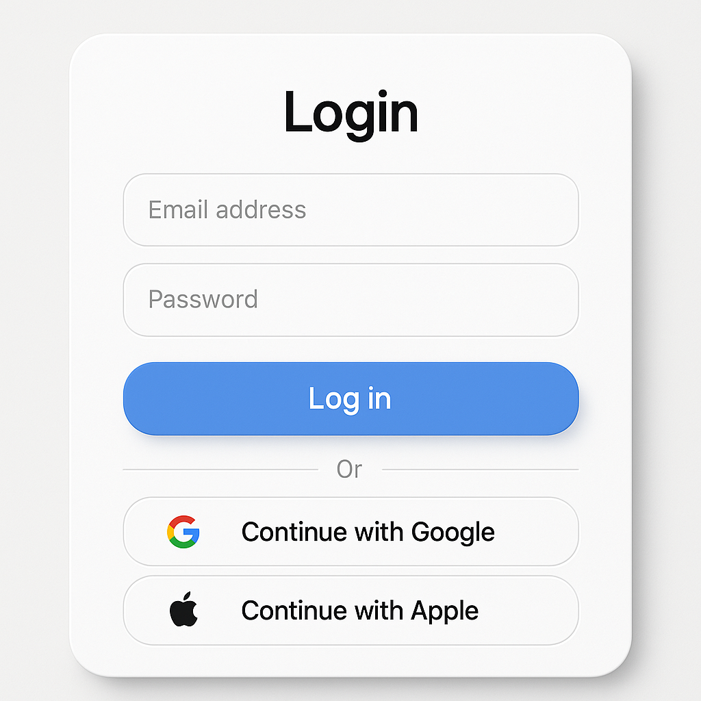

# Site Método Atuarial

<p align="center">
	
</p>

Projeto moderno, seguro e automatizado para gestão de clientes, serviços e área restrita, baseado em Next.js, React 19, Auth.js, Prisma, shadcn/ui, TailwindCSS e padrões de mercado.

---

## 🚀 Visão Geral

Este repositório contém o monorepo do Site Método Atuarial, incluindo:

- **site-metodo/**: Aplicação Next.js principal (SSR, API, área do cliente, admin, autenticação, etc.)
- **fuse-react/**: Base de design system e componentes Fuse adaptados
- **nextjs-app/**: Protótipos e testes avançados

O projeto é focado em segurança, automação, acessibilidade, CI/CD e experiência de desenvolvedor.

---

## 📦 Tecnologias & Padrões

- **Next.js 15+** (SSR, API, Rotas modernas)
- **React 19**
- **TypeScript (strict)**
- **Auth.js v5+** (OAuth seguro, JWT, Google, Apple, GitHub, Microsoft)
- **Prisma ORM** (PostgreSQL, SQLite, migrations, seeds)
- **shadcn/ui** (componentização, acessibilidade, design system)
- **TailwindCSS 4+** (utilitários, animações, dark mode)
- **Zod** (validação tipada)
- **Jest + Testing Library** (testes unitários e integração)
- **ESLint, Prettier, Commitlint, Husky** (qualidade e padronização)
- **Automação de changelog/versionamento** (standard-version, commitizen)
- **CI/CD pronto para Vercel/Netlify**

---

## 🛠️ Instalação Rápida

```bash
git clone https://github.com/FelipeMartini/SiteMetodoAtuarial.git
cd SiteMetodoAtuarial/site-metodo
cp .env.example .env.local # configure as variáveis de ambiente
npm install
npm run dev
```

> Para rodar testes: `npm run test`

---

## 📋 Scripts & Tasks Principais

| Comando/Task | Tipo | Descrição |
|--------------|------|-----------|
| `npm run dev` | Script npm | Inicia o servidor Next.js em modo desenvolvimento |
| `npm run build` | Script npm | Build de produção Next.js |
| `npm run start` | Script npm | Inicia servidor Next.js em produção |
| `npm run lint` | Script npm | Lint do projeto (ESLint) |
| `npm run type-check` | Script npm | Checagem de tipos TypeScript |
| `npm run prisma:generate` | Script npm | Gera tipos do Prisma |
| `npm run prisma:seed` | Script npm | Executa seeds do banco |
| `npm run analyze` | Script npm | Build com análise de bundle |
| `npm run release` | Script npm | Gera changelog, versiona e commita (Conventional Commits) |
| `npm run postrelease` | Script npm | Push dos commits/tags do release |
| `./git-auto.sh` | Shell | Automação completa de git add/commit/push/changelog |
| **Commit Convencional (Commitizen)** | Task VS Code | Commit interativo padronizado |
| **Build Next.js Absoluto** | Task VS Code | Build de produção Next.js |
| **Iniciar Next.js** | Task VS Code | Inicia servidor Next.js, matando instâncias antigas |
| **Cobertura de Testes** | Task VS Code | Executa testes com cobertura |
| ... | ... | ... |

Veja a tabela completa de tasks/scripts no final deste README.

---

## 🗂️ Estrutura do Projeto

```
SiteMetodoAtuarial/
├─ site-metodo/         # App Next.js principal
│  ├─ src/
│  │  ├─ app/           # Rotas, páginas, APIs
│  │  ├─ components/    # Componentes reutilizáveis (shadcn/ui, custom)
│  │  ├─ styles/        # Tailwind, temas, utilitários globais
│  │  ├─ prisma/        # Schema, seeds, migrations
│  │  ├─ hooks/, utils/, types/
│  ├─ public/           # Assets públicos
│  ├─ package.json, tsconfig.json, ...
├─ fuse-react/          # Base de design system Fuse
├─ nextjs-app/          # Protótipos/experimentos
├─ git-auto.sh          # Script de automação git
├─ .versionrc, commitlint.config.js, ...
```

---

## 💡 Diferenciais & Boas Práticas

- **Automação total de git, changelog e versionamento**
- **Padronização de commits (Conventional Commits, commitizen, husky)**
- **Acessibilidade e responsividade garantidas**
- **Segurança: OAuth, JWT, variáveis .env, dependências auditadas**
- **Testes automatizados e cobertura**
- **Documentação e onboarding facilitados**
- **Pronto para deploy em Vercel/Netlify**

---

## 🤝 Como Contribuir

1. Faça um fork do projeto
2. Crie uma branch: `git checkout -b minha-feature`
3. Commit seguindo o padrão: `npx git-cz` ou `npm run commit`
4. Push: `git push origin minha-feature`
5. Abra um Pull Request

Consulte o arquivo `CONTRIBUTING.md` (se existir) para mais detalhes.

---

## 🔒 Segurança

Achou alguma vulnerabilidade? Por favor, abra uma issue ou envie um e-mail para o mantenedor.
Nunca exponha segredos ou credenciais em commits.

---

## 📄 Licença

Este projeto é licenciado sob os termos da licença MIT. Veja o arquivo LICENSE para mais detalhes.

---

## 📚 Links Úteis

- [Documentação Next.js](https://nextjs.org/docs)
- [Documentação Auth.js](https://authjs.dev/)
- [Documentação Prisma](https://www.prisma.io/docs/)
- [Documentação shadcn/ui](https://ui.shadcn.com/)
- [Documentação TailwindCSS](https://tailwindcss.com/docs)
- [Conventional Commits](https://www.conventionalcommits.org/pt-br/v1.0.0/)

---

# ⚠️ AVISO IMPORTANTE SOBRE O CLI DO SHADCN/UI

> **O pacote `shadcn-ui` está DEPRECIADO!**
>
> Sempre utilize o CLI oficial atualizado para instalar ou atualizar componentes shadcn/ui:
>
> ```bash
> npx shadcn@latest add <componente>
> ```
>
> **NUNCA use:**
> `npx shadcn-ui@latest ...` (DEPRECIADO)
>
> Consulte sempre a documentação oficial: https://ui.shadcn.com/docs/cli
>
> Este aviso deve ser revisitado e reforçado em toda documentação e automação do projeto.

---

## 🔄 Automação de Gerenciamento de Dependências

O projeto possui automação completa para instalar, atualizar, remover, auditar e listar dependências via scripts e tasks do VS Code.

Consulte o arquivo [`scripts/README-dependencias.md`](scripts/README-dependencias.md) para detalhes completos, exemplos e instruções.

### Principais tasks VS Code:

| Task/Script | Descrição |
|-------------|-----------|
| **Dependências: Instalar (ci/padrão)** | Instala dependências (modo limpo ou padrão, escolha via prompt) |
| **Dependências: Atualizar (todas)** | Atualiza todas as dependências para a última versão |
| **Dependências: Atualizar (interativo)** | Atualização interativa (escolha quais atualizar) |
| **Dependências: Atualizar (específica)** | Atualiza um pacote específico (prompt) |
| **Dependências: Remover (específica)** | Remove um pacote específico (prompt) |
| **Dependências: Listar desatualizadas** | Lista dependências desatualizadas |
| **Dependências: Auditoria de vulnerabilidades** | Checa vulnerabilidades (npm audit) |
| **Dependências: Corrigir vulnerabilidades** | Corrige vulnerabilidades automaticamente (npm audit fix) |

Todos os fluxos são seguros, modernos e integrados ao VS Code, com prompts e variáveis para facilitar o uso.

---

## 🏁 Tabela Completa de Tasks/Scripts

| Nome/Comando | Tipo | Descrição |
|--------------|------|-----------|
| `npm run dev` | Script npm | Inicia o servidor Next.js em modo desenvolvimento |
| `npm run build` | Script npm | Build de produção Next.js |
| `npm run start` | Script npm | Inicia servidor Next.js em produção |
| `npm run lint` | Script npm | Lint do projeto (ESLint) |
| `npm run type-check` | Script npm | Checagem de tipos TypeScript |
| `npm run prisma:generate` | Script npm | Gera tipos do Prisma |
| `npm run prisma:seed` | Script npm | Executa seeds do banco |
| `npm run analyze` | Script npm | Build com análise de bundle |
| `npm run release` | Script npm | Gera changelog, versiona e commita (Conventional Commits) |
| `npm run postrelease` | Script npm | Push dos commits/tags do release |
| `./git-auto.sh` | Shell | Automação completa de git add/commit/push/changelog |
| **Commit Convencional (Commitizen)** | Task VS Code | Commit interativo padronizado |
| **Changelog/Versionamento/Push Automático** | Task VS Code | Executa todo o fluxo automatizado, incluindo changelog, versionamento e push, com mensagem padrão |
| **Git Auto Commit & Push** | Task VS Code | Commit e push direto com mensagem customizável |
| **Instalar dependências** | Task VS Code | Instala todas as dependências do projeto (npm install) |
| **Atualizar dependências** | Task VS Code | Atualiza todas as dependências do projeto (npm update) |
| **Backup node_modules e lock** | Task VS Code | Cria backup compactado do node_modules e package-lock.json |
| **Limpeza-Geral** | Task VS Code | Remove build, node_modules e cache, reinstala dependências e gera Prisma |
| **Diagnóstico: Checar ambiente Node/Prisma** | Task VS Code | Exibe versões do Node, NPM, Prisma e variáveis do .env |
| **Diagnóstico: Mostrar logs de build** | Task VS Code | Exibe logs de erro de build do projeto |
| **Prisma Generate Absoluto** | Task VS Code | Gera os tipos do Prisma manualmente |
| **Segurança: npm audit fix** | Task VS Code | Executa correção automática de vulnerabilidades npm |
| **Atualizar shadcn/ui** | Task VS Code | Atualiza os componentes shadcn/ui para a última versão |
| **Lint Absoluto** | Task VS Code | Executa o linter do projeto |
| **Type Check Absoluto** | Task VS Code | Executa checagem de tipos TypeScript |
| **Build Next.js Absoluto** | Task VS Code | Executa build de produção do Next.js |
| **Iniciar Next.js / Iniciar Next.js Seguro** | Task VS Code | Inicia o servidor Next.js, matando instâncias antigas |
| **Reiniciar Next.js** | Task VS Code | Reinicia o servidor Next.js |
| **Parar Next.js / Finalizar todas as instâncias Node.js / Finalizar servidores Next.js** | Task VS Code | Encerra servidores Next.js nas portas 3000-3010 |
| **Cobertura de Testes** | Task VS Code | Executa testes com cobertura (Jest) |
| **Smoke Test Next.js** | Task VS Code | Executa smoke test do Next.js |
| **Build Completo Seguro** | Task VS Code | Executa toda a cadeia de build, lint, type-check, testes e segurança |
| **Start Seguro** | Task VS Code | Executa build completo e inicia o servidor Next.js |

---

<p align="center">
	<em>Projeto desenvolvido e mantido por Felipe Martini e colaboradores.</em>
</p>
